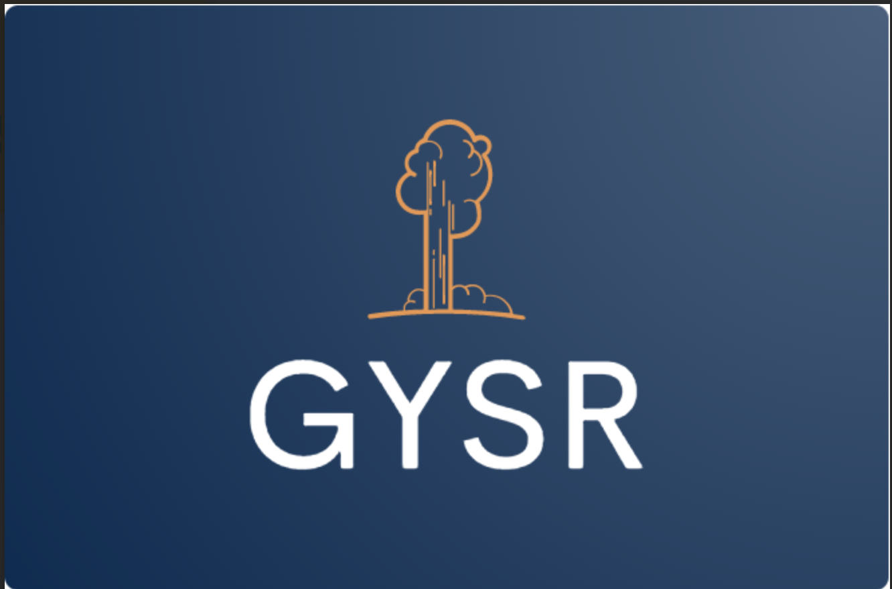

#  GYSR

## 📖 Table of Contents
- [General Info](#general-info)
- [Demo](#demo)
  - [Overview](#overview)
  - [Related Items](#related-items)
  - [Ratings & Reviews](#ratings--reviews)
  - [Q&A](#qa)
- [Technologies Used](#-technologies-used)
- [Installation and Setup](#-installation-and-setup)
- [Contributors](#-contributors)

## 🗻 General Info
GYSR.now (Get Your Stuff Right Now) is an e-commerce website specializing in marketing and selling luxury goods.

## 😤 Demo

### Overview


### Related Items


### Ratings & Reviews


### Q&A


### 💻 Technologies Used
- Axios: Version 1.3.4
- Babel: 7.21.3
- Bluebird: 3.7.2
- Cloudinary: 1.9.2
- DaisyUI - 2.51.4
- Express - 4.18.2
- Jest: 29.5.0
- React: 18.2.0
- React-dom: 18.2.0
- React-Redux: 8.0.5
- ReduxJS Toolkit 1.9.3
- Redux: 4.2.1
- TailwindCSS: 3.2.7

### 🚀 Installation and Setup

````
$ git clone https://github.com/rfe2302-team-yellowstone/fec.git
$ cd ../fec.git
$ npm install
$ npm run react-dev
$ npm run server-dev
$ npm run tailwind-dev
````

Set up a .env file with the following:
- API_KEY=[your Github API key]

### 🤝 Contributors
- [Stephen Perkins](https://github.com/s-perk)
- [Jose Umana](https://github.com/joseumana)
- [Zack Freeman](https://github.com/zfreeman341)
- [Zach Timmerman](https://github.com/zttimmerman)